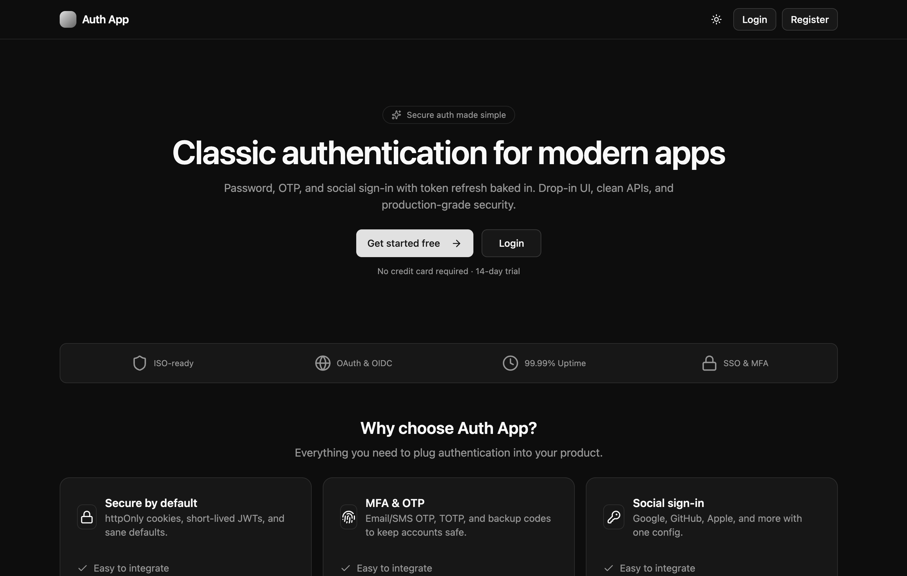
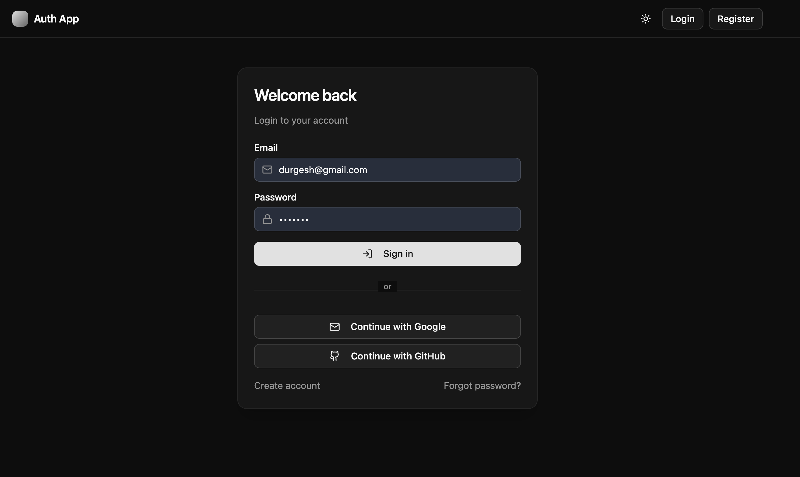
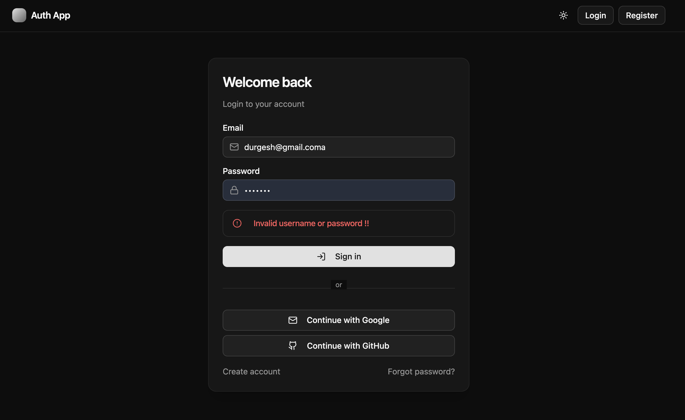
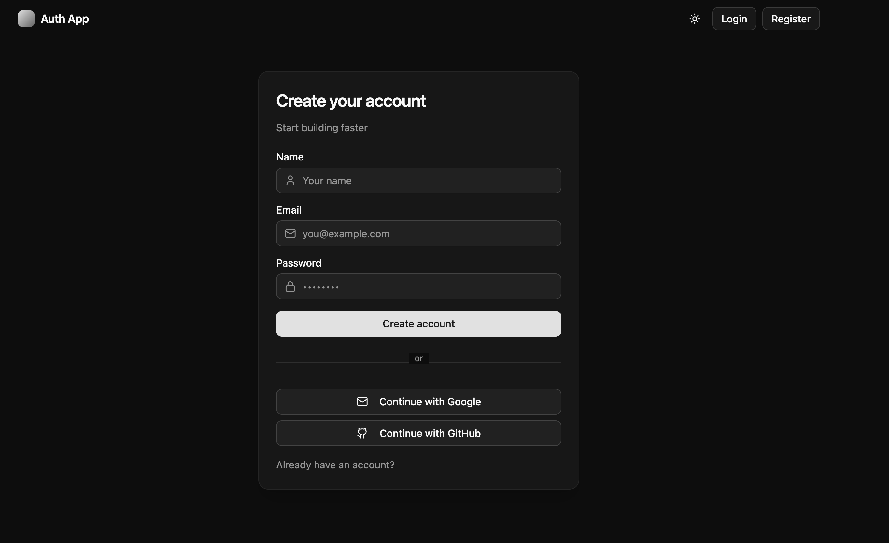
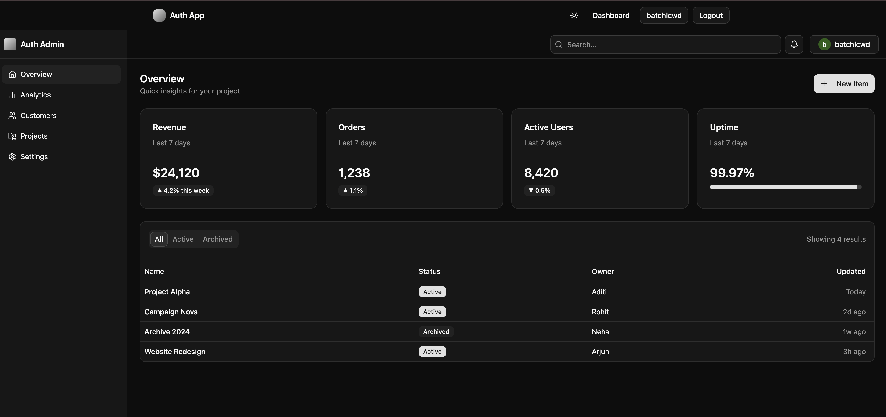

# 🔐 Full Stack Authentication App — React + Vite + Spring Boot

A complete **authentication system** built using **React (Vite)** on the frontend and **Spring Boot** on the backend.
Supports **JWT-based authentication** with **username/password login**, cookie-based **refresh token rotation**, and **Google** and **GitHub OAuth2 login**.

**Live demo:**
- Frontend: **https://auth-app-ts.netlify.app**
- Backend: **https://auth-application-springboot.onrender.com**

> ⚠️ The backend runs on Render's free tier, which spins down after 15 minutes of inactivity. The first request after idle time may take 30–60 seconds to respond.

---

## 🧱 Tech Stack

### 🖥️ Frontend

- React 19 + Vite
- TypeScript
- Tailwind CSS
- Axios
- React Router DOM
- Zustand (auth state store)
- Lucide React (icons)
- react-hot-toast

### ⚙️ Backend

- Spring Boot 3.5.x
- Java 21
- Spring Security 6.x
- Spring Data JPA (MySQL)
- OAuth2 Client (Google, GitHub)
- JWT Authentication (jjwt)
- Lombok + HikariCP
- springdoc-openapi (Swagger UI)

---

## Screenshots

### Home page



### Login page



### Login page with error



### Register page



### Dashboard



## 📁 Project Structure

```

## 📁 Project Structure

This is a monorepo containing both the frontend and backend:

```
    auth-application-springboot/
    │
    ├── auth-backend/             # Spring Boot Backend
    │   ├── src/ 
    │   │   └── main/
    │   │       ├── java/com/substring/auth/app/
    │   │       └── resources/
    │   │           ├── application.yaml
    │   │           ├── application-dev.yml
    │   │           └── application-prod.yml
    │   ├── Dockerfile
    │   ├── .dockerignore
    │   ├── .env.example
    │   └── pom.xml
    │
    ├── auth-front/                # React + Vite Frontend
    │   ├── src/
    │   ├── public/
    │   ├── .env.example
    │   ├── package.json
    │   └── vite.config.ts
    │
    └── README.md
```

---

## ⚙️ Backend Setup (Spring Boot)

### 🧩 Prerequisites

- Java 21
- Maven 3.9+
- MySQL (local, or a hosted instance such as [Aiven's free MySQL tier](https://aiven.io))
- Git

### 🧰 Steps to run locally

1. Navigate to the backend folder:

   ```bash
   cd auth-backend
   ```

2. Create a database (skip if using a hosted MySQL instance):

   ```sql
   CREATE DATABASE auth_app;
   ```

3. Copy the example env file and fill in real values:

   ```bash
   cp .env.example .env
   ```

   The `dev` profile is active by default (`spring.profiles.active: dev` in `application.yaml`) and runs on **port 8083**.

4. Run the app:

   ```bash
   mvn spring-boot:run
   ```

📍 Backend runs on **https://auth-application-springboot.onrender.com**

### 🐳 Running with Docker

A production-ready multi-stage `Dockerfile` is included:

```bash
docker build -t auth-backend .
docker run -p 8080:8080 --env-file .env auth-backend
```

The container listens on the port provided via the `PORT` environment variable (falls back to `8080` if unset) — this makes it compatible with platforms like Render that inject their own port at runtime.

---

## 💻 Frontend Setup (React + Vite)

### 🧩 Prerequisites

- Node.js 18+
- npm

### ⚙️ Steps to run locally

1. Navigate to the frontend directory:

   ```bash
   cd auth-front
   ```

2. Install dependencies:

   ```bash
   npm install
   ```

3. Copy the example env file:

   ```bash
   cp .env.example .env
   ```

   ```
   VITE_API_BASE_URL=https://auth-application-springboot.onrender.com/api/v1
   VITE_BASE_URL=https://auth-application-springboot.onrender.com
   ```

4. Start the dev server:

   ```bash
   npm run dev
   ```

📍 Frontend runs on **https://auth-app-ts.netlify.app/**

### 📦 Build for production

```bash
npm run build
```

Output is generated in `auth-front/dist`.

---

## 🔗 Authentication Flow

1. **User Login (Email/Password)**
   - User logs in via the frontend.
   - Backend verifies credentials against the database.
   - Returns a short-lived **access token** in the response body and sets a long-lived **refresh token** as an `HttpOnly` cookie.

2. **OAuth Login (Google / GitHub)**
   - Redirects to `/oauth2/authorization/{provider}`.
   - On success, the backend issues tokens and redirects to the frontend's success URL; on failure, to the failure URL.

3. **Token Refresh**
   - When the access token expires, the frontend calls `/api/v1/auth/refresh`.
   - The backend reads the refresh token from the `HttpOnly` cookie (or, as a fallback, from the request body, an `X-Refresh-Token` header, or an `Authorization: Bearer` header), rotates it, and issues a new access/refresh token pair.

4. **Logout**
   - Refresh token is revoked server-side and the cookie is cleared.

---

## 🔑 API Endpoints

| Method | Endpoint                         | Description                          |
| ------ | --------------------------------- | ------------------------------------- |
| `POST` | `/api/v1/auth/register`           | Register a new user                   |
| `POST` | `/api/v1/auth/login`              | Login with email & password           |
| `POST` | `/api/v1/auth/refresh`            | Rotate refresh token, issue new pair  |
| `POST` | `/api/v1/auth/logout`             | Revoke refresh token, clear cookie    |
| `GET`  | `/oauth2/authorization/google`    | Redirect to Google login              |
| `GET`  | `/oauth2/authorization/github`    | Redirect to GitHub login              |

> Full interactive API documentation is available via Swagger UI at `/swagger-ui.html` on the backend.

---

## 🧠 Environment Variables

### Backend (`auth-backend/.env` — see `.env.example`)

| Variable                        | Description                                   |
| -------------------------------- | ---------------------------------------------- |
| `DB_URL`                        | JDBC connection string (e.g. `jdbc:mysql://host:port/db?sslMode=REQUIRED`) |
| `DB_USERNAME`                   | Database username                              |
| `DB_PASSWORD`                   | Database password                              |
| `GOOGLE_CLIENT_ID`              | Google OAuth client ID                         |
| `GOOGLE_CLIENT_SECRET`          | Google OAuth client secret                     |
| `GITHUB_CLIENT_ID`              | GitHub OAuth client ID                         |
| `GITHUB_CLIENT_SECRET`          | GitHub OAuth client secret                     |
| `JWT_SECRET`                    | Secret key for signing JWTs                    |
| `JWT_ISSUER`                    | JWT issuer claim                               |
| `JWT_ACCESS_TTL_SECONDS`        | Access token lifetime in seconds               |
| `JWT_REFRESH_TTL_SECONDS`       | Refresh token lifetime in seconds              |
| `JWT_REFRESH_COOKIE_NAME`       | Name of the refresh-token cookie               |
| `JWT_COOKIE_SECURE`             | Whether the cookie requires HTTPS              |
| `JWT_COOKIE_HTTP_ONLY`          | Whether the cookie is `HttpOnly`                |
| `JWT_COOKIE_SAME_SITE`          | `Lax` for same-site deployments, `None` for cross-site (frontend and backend on different domains) |
| `JWT_COOKIE_DOMAIN`             | Cookie domain — leave unset/omit for cross-domain deployments so the browser defaults to the exact response host |
| `FRONT_END_URL`                 | Allowed CORS origin(s), comma-separated for multiple |
| `FRONT_END_SUCCESS_REDIRECT`    | Where to redirect after successful OAuth login |
| `FRONT_END_FAILURE_REDIRECT`    | Where to redirect after failed OAuth login     |
| `PORT`                          | Injected automatically by the host platform (e.g. Render) — do not set manually |

### Frontend (`auth-front/.env` — see `.env.example`)

| Variable              | Description                              |
| ----------------------| ------------------------------------------ |
| `VITE_API_BASE_URL`   | Backend API base URL, including `/api/v1`  |
| `VITE_BASE_URL`       | Backend root URL (used for OAuth redirects)|

---

## 🧰 Common Commands

| Task                 | Command                          |
| --------------------- | --------------------------------- |
| Run backend (dev)     | `mvn spring-boot:run`             |
| Package backend       | `mvn clean package -DskipTests`   |
| Run backend JAR       | `java -jar target/*.jar`          |
| Build backend image   | `docker build -t auth-backend .`  |
| Run frontend (dev)    | `npm run dev`                     |
| Build frontend        | `npm run build`                   |

---

## 🧩 Deployment

This project is deployed as two separate services:

### Backend → [Render](https://render.com)

- **Root/base directory:** `auth-backend`
- **Environment:** Docker (uses the included `Dockerfile`)
- **Instance type:** Free (spins down after 15 min idle)
- Set all backend environment variables listed above in Render's **Environment** tab.
- `server.port` reads `${PORT:8080}` so it automatically binds to whatever port Render assigns.

### Frontend → [Netlify](https://netlify.com)

- **Base directory:** `auth-front`
- **Build command:** `npm run build`
- **Publish directory:** `dist` (relative to base directory)
- Set `VITE_API_BASE_URL` and `VITE_BASE_URL` in Netlify's **Environment variables** settings, pointing to the deployed backend.

### Database → [Aiven](https://aiven.io) (free MySQL tier)

- Requires `sslMode=REQUIRED` in the JDBC connection string.

### ⚠️ Cross-domain cookie notes

Since the frontend and backend are hosted on different domains in production, the refresh-token cookie requires:
```
JWT_COOKIE_SAME_SITE=None
JWT_COOKIE_SECURE=true
JWT_COOKIE_DOMAIN=   # leave empty
```
`SameSite=Lax` (a common local-dev default) will silently block the cookie from being sent on cross-site requests once frontend and backend are on separate domains.

Update OAuth redirect URIs in the Google Cloud Console and GitHub OAuth App settings to match your deployed backend's callback URL:
```
https://<your-backend-domain>/login/oauth2/code/google
https://<your-backend-domain>/login/oauth2/code/github
```

---

## 🔒 Security Notes

- Never commit `.env` files — use the provided `.env.example` templates and set real secrets via your hosting platform's environment variable dashboard.
- If secrets are ever accidentally committed, rotate them immediately (regenerate OAuth client secrets, change DB password, generate a new JWT secret) even if the push was blocked by GitHub's secret scanning.
